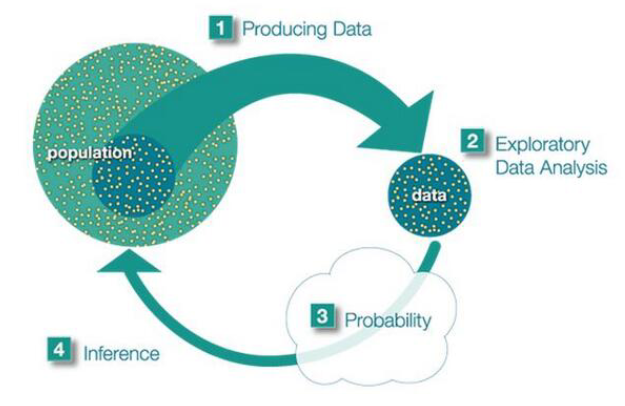
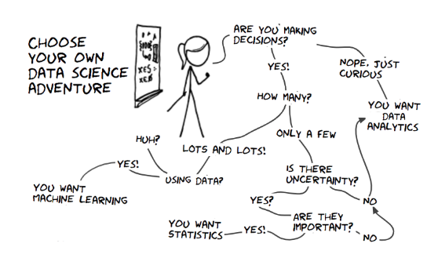

# Estimation

## exploratory versus inference 探索性和推理性

Looking at the data and reporting what’s there (just go with the estimate!) or concluding w.r.t the underlying population from which data is from (hypothesis testing)

## basic concepts of estimation

### estimator

statistic (function of observations) whose calculated value is used to estimate a parameter $\theta$

### estimate

specific realization of an estimator

$$
\hat{\theta} = g(X_1, X_2, \ldots, X_n) \\
\text{where } X_1, X_2, \ldots, X_n \text{ are}
$$

with pdf/pmf denoted

## Bernoulli Distribution

https://www.cnblogs.com/LCharles/p/11906737.html

## Normal Distribution

https://www.cnblogs.com/bigmonkey/p/11353662.html

https://blog.csdn.net/Joyliness/article/details/80097491

https://www.cnblogs.com/bigmonkey/p/11379144.html

https://blog.csdn.net/tMb8Z9Vdm66wH68VX1/article/details/130907883
