# statistical concept 統計學概念

## PMF and CDF

PMF定義的值是P(X=x)，而CDF定義的值是P(X <= x)，x為所有的實數線上的點。

### probability mass function (PMF) 概率質量函數

$$
pX(x)=P(X=x)
$$

是離散隨機變數在各個特定取值上的概率。有時也被稱為**離散密度函數**。

概率密度函數通常是*定義離散隨機分佈的主要方法*，

並且此類函數存在於其定義域是：

1. 離散的純量變數
2. 多遠隨機變數

[維基百科](https://zh.wikipedia.org/zh-tw/%E6%A6%82%E7%8E%87%E8%B4%A8%E9%87%8F%E5%87%BD%E6%95%B0)

### Cumulative distribution function(CDF)累積分佈函數

$$
FX(x)=P(X<=x)
$$

也叫概率分佈函數或分佈函數

是概率密度函數的**積分**

能夠完整的描述一個實隨機變數X的概率分佈

[維基百科](https://zh.wikipedia.org/zh-tw/%E7%B4%AF%E7%A7%AF%E5%88%86%E5%B8%83%E5%87%BD%E6%95%B0)

## probability density function（PDF）概率密度函數

[PDF](https://www.geeksforgeeks.org/probability-density-function/)

[概率密度函數（Probability Density Function， PDF）-CSDN博客](https://blog.csdn.net/YHKKun/article/details/137404224)

## Central Limits 中央界限

Support we have a set of independent random variables $X_{i}$ for $i=1,....,n$ with:

$Mean(X_{i})=\mu$        $Var(X_{i})=V$       for all $i$

Then as $n$ becomes large, the sum:

$$
S_{m}=\sum\limits_{i = 1}^n {{X_i} \to {\rm N}(n\mu ,nV)}
$$

**tends to become normally distributed.**

### Absence of Central Limits

**Another case is where the moments are not defined / infinite 另一種情況是力矩不確定或無限大**

# Randomness 隨機性

## Motivation 動機

Three main ways that random comes into data science:

1. The data themselves are often best understood as random 數據本身通常最好被理解為隨機
2. **When we want to reason under **subjective uncertainty **(for example in Bayesian approaches) then unknown quantities can be represented as random. Often when we make predictions they will be **probabilitic 當我們主管不確定性的情況下進行推理時，可以將未知量表示為隨機量，當我們進行預測時，他們將是概率性的
3. Many of the most effective / efficient / commonly‑used algorithms in data science—typically called Monte Carlo algorithms—exploit randomness. 蒙特卡洛算法

- Unpredictable 不可預測性
- Subjective uncertainty 主管不確定性

## The logistic map 邏輯地圖（單峰映象）

是一個二次多項式映射(遞歸關係)经常作为典型范例来说明复杂的混沌现象是如何从非常简单的非线性动力学方程中产生的。

is an example of deterministic chaos 是確定性混沌的一個例子 but whose results are apparently not easy to predict. 結果不容易被預測

它在一定程度上是一个时间离散的人口统计模型

Logistic模型可以描述生物種群的演化，它可以表示成一維非線性迭代方程 $x_{n+1}=rx_{n}(1-x_{n})$

其中 $𝑥_{𝑛}$  表示种群的个数，第一项表示第n+1代与第n代成正比，第二项表示环境因素对种群繁殖数目的限制。当然我们已经假定$𝑥$ 大于零且小于一,$𝑟$大于零且小于四（显然）。他们之间的函数关系为抛物线型。这是一种典型的负反馈机制（单峰），logistic模型是二次函数关系，当然我们还可以设定为sin之类的函数。因为单峰是一种最简单，也是自然界最常见的一种负反馈机制

Math:

$$
\displaystyle{ x(t+1)=\mu x(t)(1-x(t)) }
$$

其中，t为迭代时间步，对于任意的t，x(t)∈[0,1]，μ为一可调参数，为了保证映射得到的x(t)始终位于[0,1]内，则μ∈[0,4]。x(t)为在t时刻种群占最大可能种群规模的比例（即现有人口数与最大可能人口数的比率）。当变化不同的参数μ时，该方程会展现出不同的动力学极限行为（即当t趋于无穷大，x(t)的变化情况），包括：稳定点（即最终x(t)始终为同一个数值）、周期（x(t)会在2个或者多个数值之间跳跃)、以及混沌（x(t)的终态不会重复，而会等概率地取遍某区间）。

当μ超过[1,4]时，就会发生混沌现象。该非线性差分方程意在观察两种情形:
• 当人口规模很小时，人口将以与当前人口成比例的速度增长进行繁殖。
• 饥饿(与密度有关的死亡率) ，其增长率将以与环境的”承受能力”减去当前人口所得值成正比的速度下降

然而，Logistic映射作为一种人口统计模型，存在着一些初始条件和参数值(如μ >4)为某值时所导致的混沌问题。这个问题在较老的瑞克模型中没有出现，该模型也展示了混沌动力学。

$0<=μ<=1$:


$1<μ<3$:


从图中得知：

当$μ$在1到2之间，种群数量会很快接近 $ \frac{μ−1}{μ}$ ,不论最初种群为何值
当$μ$在2到3之间，人口数在经历一段时间的波动后会趋于稳定值 $\frac{μ−1}{μ}$,其收敛速度满足线性变化。但当μ=3时，比线性收敛还要缓慢。

事实上，只要μ < 3 μ<3μ<3，系统都会收敛到一个不动点，而这个不动点的数值可以通过求解下列方程而得到：

$$
X^{*}=\mu x^{*}(1-x^{*})
$$

不同参数 μ \muμ下的极限行为
不论μ取任意值，最多有一个稳定的周期。 如果存在一个稳定的周期，那么它是全局稳定的，吸引了几乎所有的点。一些具有周期稳定循环的μ在某些时候会有无穷多个不同周期的不稳定循环。

为了概括上述各种数值模拟试验的结果，我们用下面的相图来表示不同μ值对应的极限行为

### Feigenbaum图


### Code operation 實現操作

```python
# Define a function that does one step of the logistic map
def logisticMap(x,r):
    return r*x*(1.0-x)
```

```python
# Construct an orbit of the logistic map
nSteps = 100
t = range(0,(nSteps + 1))
r = 3.9
x = np.zeros(nSteps + 1) # initialise the result as a vector of zeroes 從0開始
x[0] = 0.1 # Choose the initial condition
for i in range(1,(nSteps + 1)):
    x[i] = logisticMap(x[i-1],r)
```

```python
# Plot the results of the previous step
plt.plot(t, x, '-', linewidth=1,color='black')
plt.scatter( t, x, color="darkviolet" ) # add dots at the points
plt.title('Logistic Map: r=' + str(r))
plt.xlabel('Step, n')
plt.ylabel('x(n)')
plt.show()
```

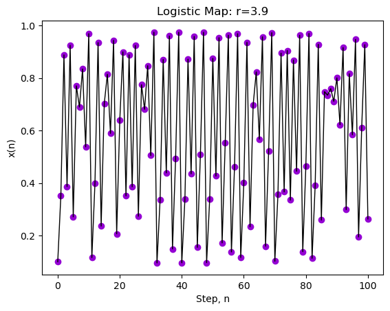

[Logistic Mapping - Encyclopedia - Complex Systems|Artificial Intelligence|Complex Science|Complex Networks|Self-Organizing](https://wiki.swarma.org/index.php?title=Logistic%E6%98%A0%E5%B0%84#.5Bmath.5D.5Cdisplaystyle.7B_0.E2.89.A4.CE.BC.E2.89.A41_.7D.5B.2Fmath.5D)

[物流圖 - 維琪百科，自由的百科全書 --- Logistic map - Wikipedia](https://en.wikipedia.org/wiki/Logistic_map)

[Logicstic映射](https://blog.csdn.net/qq_41137110/article/details/115249684)

[Logistic映射（编程训练） - 知乎](https://zhuanlan.zhihu.com/p/578152437)

[Logistic.nb.pdf](https://abel.math.harvard.edu/archive/118r_spring_99/doc/proj/2/Logistic.nb.pdf)

## entropy 熵

另一种方法是利用计算机外部因素来产生随机性， 例如鼠标点击的位置和时间。 在此， 我们将考虑把代码运行的时间作为外部因素

即使用系统时钟当前时间的小数点后六位数字（分辨率为微秒）

R和Matlab 使用軟件包提供隨機數生成的函數

## Estimation of $π$ **using Monte Carlo methods**

假設我們將 $\pi$ 定義為半徑為1的圓的面積根據其定義來估算這個數字，

we will pick random values of $x$ and $y$ independently from a uniform distribution between 0 and **1**, then let the random variable $Z$ equal 1 if the point $(x, y)$ falls within the quarter-circle shown and 0 otherwise. This $Z$ allows us to make an estimate of $π$ **in that its expected value, $E[Z] = π/4$**. We can then define a random variable **A**n to be the average of $n$ **independent samples of $Z$**. Formally:

$$
{{\rm{A}}_n} = \frac{1}{n}\sum\limits_{i = 1}^n {{Z_i} = \frac{\pi }{4} + {\varepsilon _n}}
$$

### Code operation

To deal with this, we'll repeat the experiment $m$ times and make a list of all the estimates

we get. We'll then arrange these results in ascending order and throw away a certain fraction $\alpha$ of the largest and smallest results. The remaining values should provide decent upper and lower bounds for an interval containing $\pi$.

```python
m = 100 # Number of estimates taken
n = 80000 # Number of points used in each estimate
```

If we increase $n$ above, we should get a more accurate estimates of $\pi$ each tme we run the experiment, while if we increase $m$, we'll get more accurate estimates of the endpoints of an interval containing $\pi$.

```python
#Generate a set of m estimates of the area of a unit-radius quarter-circle
np.random.seed(42) # Seed the random number generator
A = np.zeros(m) # A will hold our m estimates
for i in range(0,m):
    for j in range(0,n):
        # Generate an (x, y) pair in the unit square
        x = np.random.rand()
        y = np.random.rand()
  
        # Decide whether the point lies in or on
        # the unit circle and set Z accordingly
        r = x**2 + y**2
        if ( r <= 1.0):
            Z = 1.0
        else:
            Z = 0
  
        # Add up the contribution to the current estimate
        A[i] = A[i] + Z
   
    # Convert the sum we've built to an estimate of pi
    A[i] = 4.0 * A[i] / float( n )
```

```python
# Calculate approximate 95% confidence interval for pi based on our Monte Carlo estimates
pi_estimates = np.sort(A)
piLower = np.percentile(pi_estimates,2.5)
piUpper = np.percentile(pi_estimates,97.5)
print(f'We estimate that pi lies between {piLower:.3f} and {piUpper:.3f}.')
```

# standard distribution

## Bernoulli 伯努利分佈

$$
P(X=x) = p^{x}(1-p)^{1-x}, x = 0, 1; 0 < p < 1
$$

only have two choices(binary situations). 只有兩個結果 例如成功失敗 硬幣正反面

****Random Variable (X):**** In the context of Bernoulli Distribution, X represents the variable that can take the values 1 or 0, denoting the number of successes occurring.

****Bernoulli Trial:**** An individual experiment or trial with only two possible outcomes.

****Bernoulli Parameter:**** This refers to the probability of success (p) in a Bernoulli Distribution.

Mean:

$$
E[X] = μ = p
$$

Variance:

$$
Var[X] = E[X^{2}] - (E[X])^2
      \\ =σ2 = p(1 - p) \ or\  pq
$$

###### **Applications of Bernoulli Distribution in Business Statistics**

****1. Quality Control:**** In manufacturing, every product undergoes quality checks. Bernoulli Distribution helps assess whether a product passes (success) or fails (failure) the quality standards. By analysing the probability of success, manufacturers can evaluate the overall quality of their production process and make improvements.

****2. Market Research:**** Bernoulli Distribution is useful in surveys and market research when dealing with yes/no questions. ****For instance,**** when surveying customer satisfaction, responses are often categorised as satisfied (success) or dissatisfied (failure). Analysing these binary outcomes using Bernoulli Distribution helps companies gauge customer sentiment.

****3. Risk Assessment:**** In the context of risk management, the Bernoulli Distribution can be applied to model events with binary outcomes, such as a financial investment succeeding (success) or failing (failure). The probability of success serves as a key parameter for assessing the risk associated with specific investments or decisions.

****4. Marketing Campaigns:**** Businesses use Bernoulli Distribution to measure the effectiveness of marketing campaigns. ****For instance,**** in email marketing, success might represent a recipient opening an email, while failure indicates not opening it. Analysing these binary responses helps refine marketing strategies and improve campaign success rates.

###### Difference between Bernoulli Distribution and Binomial Distribution 伯努利分佈和二項分佈的區分

The Bernoulli Distribution and the Binomial Distribution are both used to model random experiments with *binary outcomes*, but they differ in how they handle multiple trials or repetitions of these experiments. 同樣是對具有二元結果的隨機實驗進行建模，但在處理多次實驗的方式上有所不同

| Basis                                 | Bernoulli Distribution                              | Binomial Distribution                                                                                             |
| ------------------------------------- | --------------------------------------------------- | ----------------------------------------------------------------------------------------------------------------- |
| ****Number of Trials****  | Single trial                                        | Multiple trials                                                                                                   |
| ****Possible Outcomes**** | 2 outcomes (1 for success, 0 for failure)           | Multiple outcomes (e.g., success or failure)                                                                      |
| ****Parameter****         | Probability of success is p                         | Probability of success in each trial is p and the number of trials is n                                           |
| ****Random Variable****   | X can only be 0 or 1                                | X can be any non-negative integer (0, 1, 2, 3, ...)                                                               |
| ****Purpose****           | Describes single trial events with success/failure. | Models the number of successes in multiple trials.                                                                |
| ****Example****           | Coin toss (Heads/Tails), Pass/Fail, Yes/No, etc.    | Counting the number of successful free throws in a series of attempts, number of defective items in a batch, etc. |

PMFs:


CDFs:


[伯努利分佈特性](https://www.geeksforgeeks.org/bernoulli-distribution-in-business-statistics-mean-and-variance/)

## Binomia

represent outcome of a single random 'trial', 它是一種離散分佈

- $n$ is the number of trials 例如民意調查樣本
- $0 \le K \le n$ is the number of successes 成功次數 例如潛在選民表示會投票給我們的候選人的次數
- $q$ is the (typically unknown) 支持我方候選人的選民比例

PMF:

$$


$$


CDF:


## Poison 泊鬆分佈

PMF:

$$
P(X = k) = {p_k} = {P_o}(k|\lambda ) = \frac{{{\lambda ^k}}}{{k!}}{e^{ - \lambda }}
$$

Mean:

$$
Mean(X)= \lambda
$$

Variance:

$$
Var(X)=\lambda
$$

PMF:


CMF:


## Beta：

**most commonly used to represent uncertainty in probabilities or proportions** 常用於表示概率或比例的不確定性

Probability density function:

$$
f(x) = Beta(x|\alpha ,\beta ) = B_{\alpha ,\beta }^{ - 1}{x^{\alpha  - 1}}{(1 - x)^{\beta  - 1}}dx
$$

for  $ x \in [0,1] $ and positive  $\alpha ,\beta $

The factor $B_{\alpha ,\beta }^{ - 1}$  is a normalizing constant

It’s chosen so that  $P(0 ≤ x ≤ 1) = 1$ and there is no simple expression for it. Instead, it’s defined as an integral:

$$
{B_{\alpha ,\beta }} = \int_0^1 {{x^{\alpha  - 1}}{{(1 - x)}^{\beta  - 1}}dx}
$$

The mean of the Beta distribution is:

$$
Mean(X)=\frac{\alpha }{{\alpha  + \beta }}
$$

Variance:

$$
Var(X)=\frac{{\alpha \beta }}{{{{(\alpha  + \beta )}^2}(1 + \alpha  + \beta )}}
$$


CDF


Application


## Gamma

is ofen used to model times between events

$$
f(x) = Gamma(x|\kappa ,\theta ) = \frac{1}{{\Gamma (\kappa ){\theta ^\kappa }}}{x^{\kappa  - 1}}{e^{ - x/\theta }}
$$

for positive $x$ and positive $\kappa$, $ \theta$

Mean:

$$
Mean(X)=\kappa \theta
$$

Variance

$$
Var(X)=\kappa \theta^2
$$

PDF


CDF


## Normal

The Normal **(also called the **Gaussian高斯**) distribution is continuous, with probability density function**

$$
f(x) = {\rm N}(x|\mu ,{\theta ^2}) = \frac{1}{{\sqrt {2\pi {\sigma ^2}} }}{e^{ - \frac{{{{(\chi  - \mu )}^2}}}{{2{\sigma ^2}}}}}
$$

Mean

$$
Mean(X)= \mu
$$

Variance

$$
Var(X)=\sigma^{2}
$$

### **Arithmetic with normally-distributed variables**

Suppose we have two random variables, **X**1 and **X**2 that are independent and are both normally distributed with means **µ**1 and **µ**2 **and variances **σ**12 **and **σ**2 2**, respectively.

#### $W=X_{1}+X_{2}$

will also be normally distributed

mean:

$$
{\mu_{W}}={\mu_{1}} + {\mu_{2}}
$$

variance:

$$
{\sigma^{2}_{W}}={\sigma^{2}_{1}}+{\sigma^{2}_{2}}
$$

#### $Y=aX_{1}+b$

will also be normally distributed

mean:

$$
\mu_{Y}=a\mu_{1}+b
$$

variance:

$$
\sigma^{2}_{Y}=a^{2}\sigma^{2}_{1}
$$

**PDF**


CDF


## **Cauchy 柯西分佈**

The Cauchy **distribution has probability density function**

$$
f(x) = \frac{1}{{\pi s(1 + {{((x - t)/s)}^2})}}
$$

$s$ is positive $t$ is parameter can be any parameters

**It has “heavy tails”, which means that large values are so common that the Cauchy distribution lacks a well-defined mean and variance!**

But the parameter $t$ **gives the location of the mode and median, which are well-defined.**

The parameter $s$ **determines the ‘width’ of the distribution as measured using e.g. the distances between percentiles, which are also well defined.**

PDF


CDF


# EDA: Exploratory data analysis

motivation:

    EDA is about getting an intuitive understanding of the data, and as such different people will find different techniques useful.

## Data quality

The first thing understand is where the data come from and how accurate they are. 數據的來源和準確性

### star rating 星級評級

This is based on experience rather than any formal theory：

- 4： Numbers we can believe. Examples: official statistics(官方統計數據); well controlled laboratory experiments
- 3： Numbers that are reasonably accurate. Examples: well conducted surveys / samples; field measurements; less well controlled experiments.
- 2：Numbers that could be out by quite a long way. Examples: poorly conducted surveys / samples; measurements of very noisy systems
- 1： Numbers that are unreliable. Examples: highly biased / unrepresentative surveys / samples; measurements using biased / low-quality equipment
- 0： Numbers that have just been made up. Examples: urban legends / memes; fabricated experimental data

## Univariate Data Vectors

univariate case: one measurement per ‘thing’ 每個變量都單獨探索

Mathematically, we represent a univariate dataset as a length-n vector:

$$
x = (x_{1},x_{2},...,x_{n})
$$

The sample mean of a function f (x) is

$$
\left\langle {{\rm{f}}(x)} \right\rangle  = \frac{1}{n}\sum\limits_{i = 1}^n {f({x_i}) = \frac{1}{n}[f({x_1}) + f({x_2}) + .... + f({x_n})]}
$$

## Visualisation and Information

There is an important distinction in visualisations between

- Lossless(無損) ones from which, if viewed at sufficiently high resolution, one could recover the original dataset
- Lossy(有損) ones, where a given plot would be consistent with many different raw datasets

Typically for complex data, choosing the lossy visualistaion that loses the ‘right’ information is key to successful visualisation.

## Multivariate Exploratory Data Analysis

- In real applications, we almost almost always have multiple features of different things measured, and are so in a multivariate rather than univariate situation

### Professional Skill

#### Data types

- Nominal or categorical (e.g. colours, car names): not ordered; cannot be added or compared; can be relabelled.
- Ordinal (e.g. small/medium/large): sometimes represented by numbers; can be ordered, but differences or ratios are not meaningful.
- Measurement: meaningful numbers, on which (some) operations make sense. They can be:
  - Discrete (e.g. publication year, number of cylinders): typically integer.
  - Continuous (e.g. height): precision limited only by measurement accuracy.

Measurements can be in an interval scale (e.g. temperature in degrees Celsius), ratio scale (say, weights in kg), or circular scale (time of day on the 24 hr clock), depending on the 0 value and on which operations yield meaningful results

#### Sample Mean

$$
\left\langle x \right\rangle : = \frac{1}{n}\sum\limits_{i = 1}^n {{x_i}}
$$

Note: We are thinking of the n samples as coming from a population of size $N  >> n$, so that each xi is a copy of a random vector of length-p, X, which has its own mean $E[X]$. In particular, $E[X] = E[〈x〉]$, but generally $E[X] \ne <x>$

|   特性   |                  Sample Mean 樣本均值                  |               Mean 總體均值               |
| :------: | :-----------------------------------------------------: | :---------------------------------------: |
| 數據來源 |                 從總體中抽取的樣本數據                 |        總體數據(所有可能得數據點)        |
|   大小   | 样本大小 nn**n** 通常远小于总体大小 NN**N** | 总体大小 NN**N** 通常很大，甚至无限 |
| 可计算性 |                      可以直接计算                      |         通常需要通过样本均值估计         |
|  稳定性  |                   会因样本不同而波动                   |             理论值，固定不变             |
|   用途   |               用于估计总体均值或统计推断               |          描述总体的真实中心趋势          |

#### Sample Covariance Matrix 樣本協方差矩陣

$$
S=[S_{ab}],  where \ \ \ \  S_{ab}= \frac{1}{n}\sum\limits_{i = 1}^n {({x_{ia}} - \left\langle {{x_a}} \right\rangle )({x_{ib}} - \left\langle {{x_b}} \right\rangle )}
$$

Where $a = 1,...,p$ and $b=1,...,p$

用于描述多维数据集中每个变量之间的 **协方差** （即变量间的线性关系）以及每个变量的方差（自相关性）。它是多元统计分析中的一个重要工具。

**用途**

1. **数据分析** ：

* 探索变量之间的线性关系（正相关、负相关或无关）。
* 确定变量的离散程度（方差）。

2. **主成分分析（PCA）** ：

* 样本协方差矩阵用于计算主成分的方向和大小。

3. **机器学习** ：

* 在降维、特征选择和数据标准化等任务中起到重要作用。

4. **概率建模** ：

* 在多元正态分布中，协方差矩阵用于描述变量间的相关性。

#### Correlation Matrix

The sample correlation matrix has elements that correspond to the slopes of the (linear) regression lines between variables

$$
R=[R_{ab}], where \ \ \ R_{ab} = \frac{{{S_{ab}}}}{{\sqrt {{S_{aa}}{S_{bb}}} }}
$$

**关矩阵**是一个矩阵，用来表示多个变量之间的 **相关性系数** （通常是皮尔逊相关系数）。它是样本协方差矩阵的标准化形式，用于比较变量之间的线性关系。

| 特征               | Covariance Maztrix                     | Correlation Matrix             |
| ------------------ | -------------------------------------- | ------------------------------ |
| 單位               | 保留变量的原始单位（如米、秒等)        | 无单位（标准化形式）           |
| 範圍               | 值的范围依赖于变量的单位和大小         | 取值范围为 [−1,1]             |
| 对比不同变量的关系 | 变量之间的关系可能因尺度不同而不易比较 | 标准化后易于比较变量之间的关系 |

**计算相关矩阵的步骤**

1. **去中心化** ：从每个变量中减去其均值。
2. **标准化** ：将每个变量除以其标准差。
3. **计算相关性** ：对于每一对变量，计算相关系数 $r_{jk}$

**用途**

1. **探索变量关系** ：

* 判断哪些变量正相关、负相关或不相关。
* 用于数据清理，移除高度相关的变量以避免多重共线性。

1. **机器学习** ：

* 特征选择：通过查看相关矩阵，去除冗余变量。
* 降维：在主成分分析（PCA）中，相关矩阵可以用于构造主成分。

1. **金融分析** ：

* 分析资产之间的相关性，用于优化投资组合。

1. **科学研究** ：

* 在实验数据中分析变量的关系。

https://en.wikibooks.org/wiki/Statistics/Different_Types_of_Data


### Visualisation


#### Bivariate visualisation techniques: 


##### Scatter Plots

A scatter plot is a lossless visualisation that involves placing a marker at $(x_{ia}, x_{ib})$ for each $i$ and some $a, b$

```python
plt.scatter(dis, wgt)
```

```R
ggplot(auto.data, aes(x=Displacement.y=Weight))+geom_point()
```

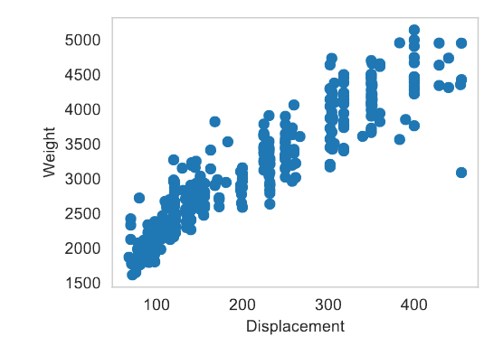


##### 2d Histograms

A 2d histogram generalised the univariate in the natural way as the count of data points falling inside a given two-dimensional area.

```python
plt.hist2d(dis,wgt,cmap="Blues")
```

```r
ggplot(auto.data, aes(x=Displacement.y=Weight))+geom_bin2d()
```


#### Higher dimensions


##### 3d Scatter

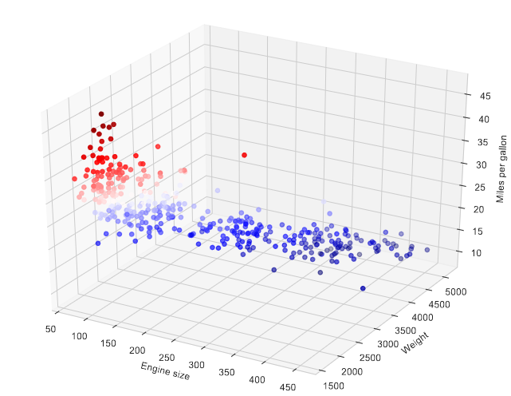


##### Scaled Scatter

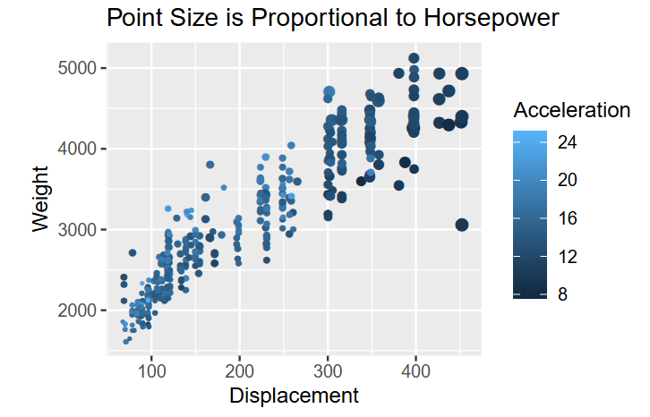

##### Plot Matrices


### Pairs of categorical variables

Contingency tables

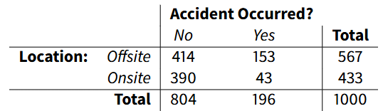

- Can be used for categorical, ordinal and discrete variables, with more than two levels
- Can write values as proportions of each row or each column
- Can write them as proportions of the total
- Can compare them with what the values would be if the two variables were independent (values would be the products of respective marginals)


### Categorical and continuous variables

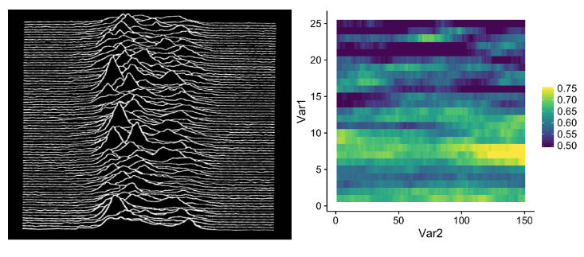


## Multivariate Distributions


### Random vectors

- For two length-p vectors $u$ and $v$, we write $u ≤ v$ only if $u_{i} ≤ v_{i}$ for each $i$ from 1 to p.
- A random variable can be defined through its cumulative distribution function; we can do the same for a random vector $X$       $F(x) = P(X ≤ x)$
- We then define the probability density function for continuous variables through  $F(b)-F(a)= \int\limits_{{x_1} = {a_1}}^{{{\rm{b}}_1}}  \cdots  \int\limits_{{x_p} = {a_p}}^{{b_p}} {f(x)dx{}_1 \cdots d{x_p}}$


### Expectations and the Multivariate Normal


#### Expectations

$$
{\rm E}\left[ {g(X)} \right] = \int\limits_{{x_1} = {a_1}}^{{{\rm{b}}_1}}  \cdots  \int\limits_{{x_p} = {a_p}}^{{b_p}} {g(x)f(x)dx{}_1 \cdots d{x_p}}
$$

- multivariate normal: $f(x) = \frac{1}{(2\pi)^{p/2}(\text{det}(\Sigma))^{1/2}} \exp\left(-\frac{1}{2}(x-\mu)^T \Sigma^{-1} (x-\mu)\right) \equiv \mathcal{N}(x|\mu,\Sigma).$
- Note that the generalisation of variance is a covariance(方差的泛化是協方差), with $cov(X)$ being a matrix with $(a, b)$-th element $E[X_{a}X_{b}] − E[X_{a}]E[X_{b}]$. For the multivariate normal多元正態分佈, the covariance matrix is $Σ$.

#### Multivariate normal contours 多元正態輪廓

- The multivariate normal distribution defines a surface that has ellipsoidal contours centred on the mean
- Consider a multivariate normal with $\mu = \begin{pmatrix} 1 \\ 1 \end{pmatrix}, \quad \Sigma = \begin{pmatrix} 1 & 0.75 \\ 0.75 & 2 \end{pmatrix}$


#### Multivariate normal as a surface

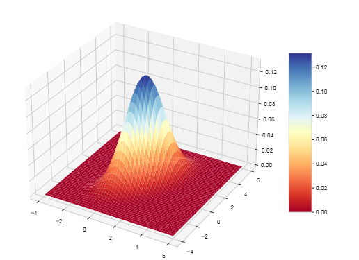

The probability of a region in the plane is given by the volume of the region beneath a surface, rather than the area beneath a curve.


#### Multivariate normal contours


plus samples:

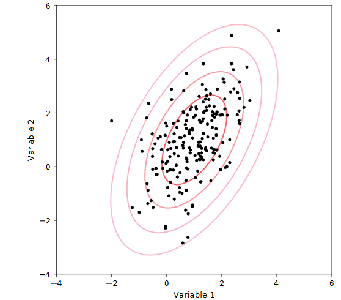


#### Centering

- When we centre data we subtract the sample mean from each row
- One natural transform on data is to subtract the mean from each row
- This can be achieved through use of a centering matrix $H = \left( I - \frac{1}{n} \mathbf{1} \mathbf{1}^T \right)$
- Then a transformed data matrix: $Y=HX$  will have mean $<y>=0$

##### Centred auto data

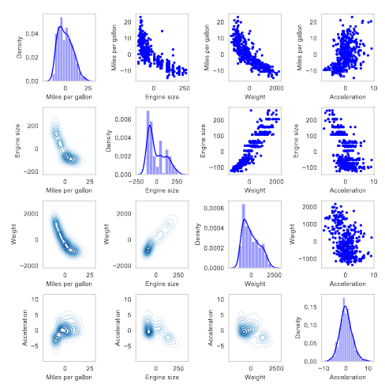


#### Standardisation

$$
D_{ab} = \begin{cases} 
S_{aa}^{-1/2} & \text{if } a = b, \\
0 & \text{otherwise.}
\end{cases}
$$

- transformed data matrix $Z=HXD=YD$   

will have mean $〈z〉 = 0 $ and variance-covariance matrix equal to X’s correlation matrix

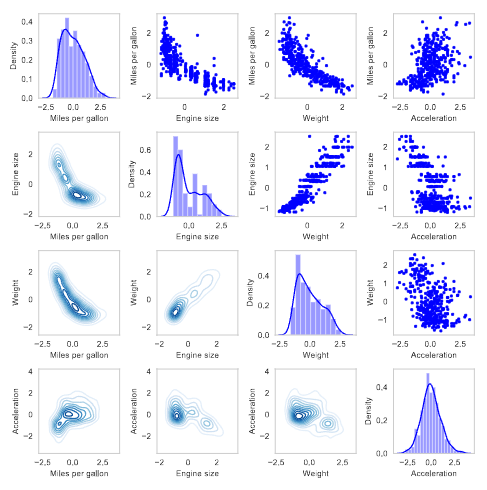


#### The Mahalanobis Transform for Data

- The matrix version of the square root is called the Cholesky decomposition $S = C^T C.$
- We can use this to remove the correlations in data through the **Mahalanobis transform**: $U=Y(C^{-1})$
- This yields a dataset with no correlations between variables, making comparison with a multivariate normal easier.

axes now show combinations of variables, rather than the original variables.

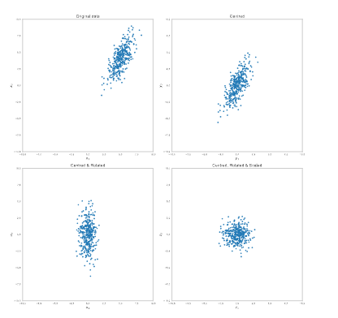


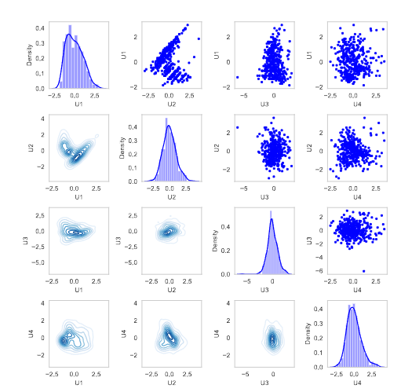


#### Spotting Deviations from Normality


- We saw that we can observe deviations from univariate normality with summary statistics such as skewness, kurtosis or through the detection pf multiple modes
- These measures also generalise to the multivariate case.
- Here we show three cases where the multivariate distribution is far from multivariate normal, even if the marginal (i.e. univariate) datasets are very close to (or even indistinguishable from) univariate normal
- We will show these using a visualisation technique known as a joint plot, where a bivariate visualisation is shown in the main panel and univariate visualisations are shown along the axes. These also show the correlation and associated p-value


### Multivariate multimodality

The data may not be centred around a unique mode. This is possible in complex ways in the multivariate case that can be far from obvious from lower dimensional analysis

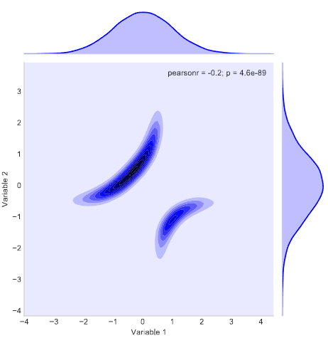


### Outliers

Some datapoints may be very far from the mode. As well as strongly affecting estimates of means and variances, this can affect estimates of correlations between variables in the multivariate case

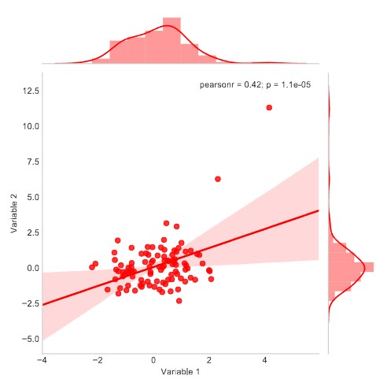


### Restricted Support

The data may only take positive values, or only values in some restricted region of space. For the multivariate case, such restrictions can be more complex than the univariate case

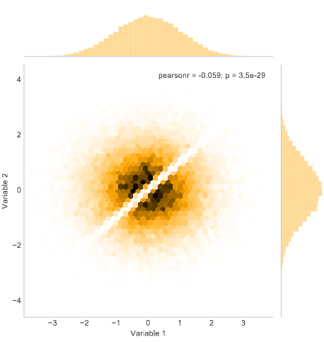


# Summary Statistics

## Measures of Central Tendency 集中趨勢測度

Often, we are interested in what a typical value of the data;

- The mean of the data is:

$$
Mean(x)=\left\langle {\rm{x}} \right\rangle  = \frac{1}{n}\sum\limits_{i = 1}^n {{x_i}}
$$

- The median of the data is the value that sits in the middle when the data are sorted by value
- A mode in data is a value of $x$ that is ‘more common’ than those around it, or a ‘local maximum’ in the density.
  - **For discrete data[离散数据] this can be *uniquely* determined as the most common value**
  - **For** **continuous data,** modes need to be ***estimated***, one aspect of a major strand in data science, estimating distributions.

### Visualising

For the data, we estimate from the kernel density that there is one mode, and its location and calculate the mean and median directly

> Example:
>
> The data are **right-skewed(右偏的)**, and as a consequence of this the mode is smallest and the mean is largest – we will consider this further; (note that for a normal distribution all would be equal.)

## Variance

|   特性   |           有偏差方差           |        無偏差方差        |
| :------: | :----------------------------: | :----------------------: |
|   分母   |               n               |           n-1           |
| 應用場景 |        描述樣本的離散型        |      估計總體的方差      |
|   偏差   |  對總體方差的估計存在低估偏差  | 對總體方差的估計是無偏的 |
| 應用場景 | 數據分析、機器學習中的樣本優化 |   統計學中總體方差估計   |

**何时使用？**

* **有偏差方差** ：在机器学习中，通常计算样本的有偏差方差（分母为 nn**n**），因为重点在于优化模型对样本的适配性，而非推断总体。
* **无偏差方差** ：在统计学和推断中，需要用无偏差方差（分母为 n−1n-1**n**−**1**），因为它更准确地估计总体参数。

$$
\begin{array}{ccccc}
Var(x) = \left\langle {{{(x - \left\langle x \right\rangle )}^2}} \right\rangle\\
= \frac{1}{n}\sum\limits_{i = 1}^n {{{({x_i} - \left\langle x \right\rangle )}^2}}\\
=\frac{1}{n}\sum\limits_{i = 1}^n {({x^2}_i - 2{x_i}\left\langle x \right\rangle  + {{\left\langle x \right\rangle }^2})}\\
=\left( {\frac{1}{n}\sum\limits_{i = 1}^n {x_i^2} } \right) + 2\left( {\frac{1}{n}\sum\limits_{i = 1}^n {{x_i}} } \right)\left\langle x \right\rangle + \frac{1}{n}\left( {\sum\limits_{i = 1}^n 1 } \right){\left\langle x \right\rangle ^2}\\
=\frac{1}{n}\left( {\sum\limits_{i = 1}^n {x_i^2} } \right) - {\left( {\frac{1}{n}\sum\limits_{i = 1}^n {{x_i}} } \right)^2}\\
=\left\langle {{x^2}} \right\rangle  - {\left\langle x \right\rangle ^2}
\end{array}
$$

### Unbiased Variance and Computation 無偏方差

$$
\begin{array}{ccccc}
\widehat {Var}(x)  = \frac{n}{{n - 1}}Var(x) \\
= \frac{1}{{n - 1}}\sum\limits_{i = 1}^n {{{({x_i} - \left\langle x \right\rangle )}^2}}\\
= \frac{1}{{n - 1}}\left( {\sum\limits_{i = 1}^n {x_i^2 - \frac{1}{n}{{\left( {\sum\limits_{i = 1}^n {{x_i}} } \right)}^2}} } \right)
\end{array}
$$

默認情況下， python計算有偏差的，R計算無偏差的

[無偏差樣本](https://en.wikipedia.org/wiki/Variance#Population_variance_and_sample_variance)

## 'Natural' units

there are two commonly-used quantities that have the same units as the data 與數據有相同單位

- mean $\mu = Mean(x)$
- standard deviation $\sigma  = \sqrt {Var(x)}$

These two quantities let us define two transformations commonly applied to data 用於數據轉換

- centring ${y_i} = {x_i} - \mu$     |   $Mean(y) = 0$
- standardisation ${z_i} = \frac{{{y_i}}}{\sigma }$  | $Var(z)=1$

## Higher moments

- In general, the $r$-th moment of the data is 第$r$時刻的數據是 ${m_r} = \left\langle {{x^r}} \right\rangle$
- The $r$-th central moment中心距 of the data is   ${\mu _r} = \left\langle {{{(x - \mu )}^r}} \right\rangle  = \left\langle {{y^r}} \right\rangle$

  where the y’s are the centred versions of the data.
- The $r$-th standardised moment of the data is ${\mu _r} = \left\langle {{{(\frac{{x - \mu }}{\sigma })}^r}} \right\rangle  = \left\langle {{z^r}} \right\rangle  = \frac{{\left\langle {{{\left( {x - \mu } \right)}^2}} \right\rangle }}{{{\sigma ^r}}} = \frac{{{\mu _r}}}{{{\sigma ^r}}}$

In theory, all higher moments are informative about the data, but in practice those with r = 3 and r = 4 are most commonly reported

### standardised moment

$$
{M_k} = \frac{{{\mu _k}}}{{{\sigma ^k}}}=\frac{{{原始矩}}}{{{標準差}}}
$$

* $M_k$：第 $k$阶标准化矩。
* $\mu_k$：第 $k$ 阶原始矩。
* $\sigma$：标准差

标准化矩通过除以标准差的 $k$ 次方，使矩的量纲消失，方便分布的比较

#### 第一阶标准化矩

$$
{M_1} = \frac{{{\mu _1}}}{{{\sigma ^1}}}
$$

表示分布的中心位置，但通常为 0（如果中心点选均值）

#### 第二阶标准化矩

$$
{M_2} = \frac{{{\mu _2}}}{{{\sigma ^2}}}
$$

恒等于 1，因为分布已经用标准差标准化。

#### 第三阶标准化矩（偏度，Skewness）

$$
{M_3} = \frac{{{\mu _3}}}{{{\sigma ^3}}}=\widetilde {{\mu _3}} = Skew(x)
$$

- 用于描述分布的对称性或偏斜程度

  - ${{\rm{M}}_3} > 0$: 分佈 偏右(右尾較長)
  - ${{\rm{M}}_3} < 0$: 分佈偏左(左尾較長)
  - ${{\rm{M}}_3} = 0$: 分佈對稱
- A larger (more **positive**) value of this quantity indicates **right-skewness**, meaning that more of the data’s variability **arises** *from* **values of x larger than the mean**
- Conversely, a smaller (more **negative**) value of this quantity indicates **left-skewness**, meaning that more of the data’s variability arises from values of x smaller than the mean.
- A value close to **zero** means that the variability of the data is similar either side of the mean (*but does not imply an overall symmetric distribution*).

#### 第四阶标准化矩（峰度，Kurtosis）

$$
{M_4} = \frac{{{\mu _4}}}{{{\sigma ^4}}}
$$

- 用于描述分布的尖峰或平坦程度.
  - ${{\rm{M}}_4} > 3$: 尖峰分佈
  - ${{\rm{M}}_4} < 3$: 平坦分佈

**用途**

* **描述分布形状** ：偏度和峰度是最常用的标准化矩，用于研究数据分布的对称性和尾部特性。
* **模型假设检验** ：例如，判断数据是否符合正态分布。
* **分布比较** ：通过标准化，消除了尺度和单位的影响，可以直接比较不同数据集的形状特征。

- A value of this quantity larger than 3 means that more of the variance of the data arises from the tails than would be expected if it were normally distributed
- A value of this quantity less than 3 means that less of the variance of the data arises from the tails than would be expected if it were normally distributed.
- A value close to 3 is consistent with, though not strong evidence for, a normal distribution.
- The difference between the kurtosis and 3 is called the excess kurtosis.

# functions

## indicator functions

The indicator function of a logical proposition A


## empirical cumulative distribution function （ECDF）


## Quantiles and Order Statistics

- The z-th percentile, $P_z$ is the value of x for which z% of the data is ≤ x
- So the median is median(x) = $P_{50}$
- This is related to the ECDF as illustrated below
- A measure of dispersal of the data is the inter-quartile range $IQR(x) = {P_{75}} - {P_{25}}$


# Density Estimation

## Histograms

histogram can be used to make an estimate of the probability density underlying a data set. Given data{ ${ {x_1}, . . . , {x_n} }$} and a collection of q + 1 bin-boundaries,$b = (b_0, b_1, . . . , b_q )$

chosen so that ${b_0} < min(x) \  and \ max(x) < {b_q}$ , we can think of the histogram-based density estimate as a piecewise-constant (that is, constant on intervals) function arranged so that the value of the estimator in the interval $b_{a−1} ≤ x < b_{a}$ is

$$
f(x|b) = \frac{1}{{{b_a} - {b_{a - 1}}}}\left( {\frac{{\left| {\{ {x_j}|{b_{a - 1}} \le {x_j} < {b_a}\} } \right|}}{n}} \right)
$$

where the second factor is the proportion of the ${x_j}$ that fall into the interval and $b_a − b_{a−1}$ is the width of the interval. These choices mean that the bar (of the histogram) above the interval has an area equal to the proportion of the data points $x_j$ that fall in that interval

## Estimating a Density with Kernels

$$
\widehat f(x|w) = \frac{1}{n}\sum\limits_{j = 1}^n {\frac{1}{w}K\left( {\frac{{x - {x_j}}}{w}} \right)}
$$

The main players in this formula are

$K(x)$: the kernel, typically some bump-shaped function such as a Gaussian or a parabolic bump. It should be normalised in the sense that

$$
\int_{ - \infty }^\infty  {K(x)\ dx = 1}
$$

$w$ : the bandwidth, which sets the width of the bumps

### Kernel Density Estimation （KDE）

是一种 **非参数方法** ，用于估计随机变量的概率密度函数（PDF，Probability Density Function）。它提供了一种平滑方式来描述数据的分布，不依赖特定的分布假设（如正态分布）

 **目标** ：

* KDE 的目标是从有限的样本数据中估计其背后的概率密度函数。
* 与直方图类似，KDE 描述了数据的分布，但比直方图更平滑且不受特定区间（bin）的影响。

 **核心公式** ：
给定 $n$ 个数据点$\{x_1, x_2, \dots, x_n\}$，KDE 在位置 $x$ 处的估计值为：

$$
f^(x)=1nh∑i=1nK(x−xih)\hat{f}(x) = \frac{1}{n h} \sum_{i=1}^{n} K\left(\frac{x - x_i}{h}\right)：在 x 处的密度估计。
$$

* $K(\cdot)$： **核函数** （Kernel Function），定义如何分布平滑权重。
* $h$： **带宽参数** （Bandwidth），控制平滑的程度。
* $x_i$：数据点。

 **核函数 $K(\cdot)$** ：

* 核函数是一个对称的非负函数，其积分为 1，通常用来为每个点分配权重。
* 常见核函数：
  * 高斯核（Gaussian Kernel）：$K(u)=12πe−u22K(u) = \frac{1}{\sqrt{2\pi}} e^{-\frac{u^2}{2}}$
  * 均匀核（Uniform Kernel）：$K(u)=12K(u) = \frac{1}{2}$（如果 $∣u∣≤1|u| \leq 1$，否则为 0）
  * 三角核（Triangular Kernel）：$K(u)=1−∣u∣K(u) = 1 - |u|$（如果 $∣u∣≤1|u| \leq 1$，否则为 0）


 **带宽** $h$：

* 带宽控制了核的扩展范围。
* $h$ 的选择非常重要：

  * $h$ 太小：估计函数会过于波动（过拟合）。
  * $h$ 太大：估计函数会过于平滑（欠拟合）。
* KDE 的核心思想是用核函数 $K(\cdot)$平滑地“覆盖”每个数据点。
* 通过将核函数中心放在每个数据点上，并根据带宽 $h$ 调整宽度，最终生成一个连续的概率密度曲线

KDE与直方图的比较

|  特點  |              直方圖              |                KDE                |
| :----: | :-------------------------------: | :--------------------------------: |
|  區間  | 数据被划分成固定宽度的区间（bin） |           不需要固定区间           |
| 平滑性 |      曲线可能不连续，有棱角      |           曲线连续、平滑           |
|  參數  |       区间宽度（bin width）       | 核函数和带宽（kernel + bandwidth） |
| 靈活性 |          对区间位置敏感          |     更灵活，适用于复杂数据分布     |

**应用场景**

1. **数据分布可视化** ：如观察数据的集中趋势和分布形态。
2. **异常检测** ：识别不符合密度分布的数据点。
3. **概率密度估计** ：用于机器学习和统计建模中的特征分布建模。

#### KDR's stacking pillows


#### Convergence 收斂

The bandwidth w is a free parameter and there are various approaches to choosing its value. For parabolic and
Gaussian kernels it is usually chosen so that  $w \propto \frac{1}{{{N^{\frac{1}{5}}}}}$


### Multivariate KDE

The kernel density estimate (KDE) approximates the population distribution function (as before) and is defined by


$$
\hat f(x|\theta ) = \frac{1}{n}\sum\limits_{j = 1}^n {K\left( {x|{x_i},\theta } \right)}
$$

Typically the kernel function K will be chosen to be the multivariate normal probability density function

$$
K\left( {x|{x_i},\theta } \right) = {\rm N}(x|{x_i},\sigma )
$$

A 2d kernel density plot shows estimated curves of constant f (x).


#### Bivariate visualisation techniques: 2d KDE

```python
sns.kdeplot(dis,wgt,cmap="Blues")
```

```r
ggplot(auto.data, aes(x=Displacement.y=Weight))+geom_density_2d()
```


## Multimodality 多態

- For continuous data, there aren’t typically identical observations (and if there are, they aren’t typical) so we will need to estimate the modes, which we define as local maxima (peaks) of the probability density
  function.
- The location and number of modes is typically the most relevant measure of central tendency and variability for multimodal data
- We will see that different estimation procedures give different modes, and even for simulated data like the below that is ‘obviously’ bimodal, they will give different answers about mode locations.


But different kernels produce different estimates—in general, there is no ‘right’ answer for this kind of unsupervised learning problem


Often we should weight the datapoints for various reasons—i.e. assign a wi to each datapoint such that


# Estimator

An **estimator** is a **mathematical rule**, function, or formula used to approximate an *unknown population parameter* (such as the mean, variance, or proportion) based on sample data. In statistical analysis, estimators are essential because they provide insights about a population when it is impractical or impossible to measure the entire population directly.


## Key Concepts of Estimators


1. Population vs. Sample：

- **Population Parameter** ($\theta$): A fixed but unknown characteristic of a population, like the true mean ($\mu$) or variance ($\sigma^2$). 總體的固定但未知的特征
- Esimator估計器($\hat{\theta}$): A statistic (function of sample data) used to estimate the **population parameter**. 用於估計總體參數的統計量

2. **Notation** :符号：

- The true population parameter is denoted by $\theta$.  真實總體參數
- The estimator (based on the sample) is denoted by $\hat{\theta}$. 基於樣本的估計量
  - Population mean: $\mu$.
  - Sample mean(estimator): $\bar{x}$.  


## Type of Estimators


1. Point Estimator: 點估計器

- Provides a single value estimate of a population parameter. 提供总体参数的**单值**估计。
- Example: The sample mean ($\bar{x}$) is a point estimator of the **population mean** ($\mu$).

2. **Interval Estimator** : 區間估計器

- Provides a **range of values** within which the population parameter is likely to lie. 提供总体参数可能位于**的值范围**
  - Example: Confidence intervals for the mean. 平均值的置信区间


## Properties of a Good Estimator


1. Unbiasedness：

- An estimator is **unbiased** if its expected value equals the true parameter: $E[\hat{θ}]=θ$  如果估计器的期望值等于真实参数，则该估计器是**无偏的**
  - Example: The sample mean ($\bar{x}$) is an unbiased estimator of the population mean ($\mu$)

2. Consistency:

- An estimator is **consistent** if it converges to the true parameter value as the sample size increases  $\hat{\theta} \xrightarrow{n \to \infty} \theta$  如果随着样本量的增加，估计量收敛到真实参数值，则该估计量是**一致的**

3. Efficiency:

- An estimator is **efficient** if it has the smallest possible variance among all unbiased estimators.  如果一个估计量在所有无偏估计量中具有最小的可能方差，则该估计量是**有效的**

4. Sufficiency 充足性

- An estimator is **sufficient** if it captures all the information in the sample relevant to the parameter being estimated. 如果估计器捕获了样本中与所估计的参数相关的所有信息，则该估计器就**足够了**


## Examples of Estimators


1. Sample Mean:

- Estimator for the population mean ($\mu$) : 总体平均值的估计量
  $$
  \hat{\mu} = \bar{x} = \frac{1}{n} \sum_{i=1}^{n} x_i
  $$

2. Sample Variance

- Biased estimator

  $$
  s^2 = \frac{1}{n} \sum_{i=1}^{n} (x_i - \bar{x})^2
  $$
- Unbiased estimator:

$$
\hat{\sigma}^2 = \frac{1}{n-1} \sum_{i=1}^{n} (x_i - \bar{x})^2
$$

3. Sample Proportion:

- Estimator for the population proportion ($p$): 人口比例的估计量

$$
\hat{p} = \frac{x}{n}
$$

Where $x$ is the number of successes and $n$ is the sample size.


## Evaluation of Estimators


1. **Mean Squared Error (MSE)** :均方误差

- Combines both bias and variance to evaluate an estimator: 结合偏差和方差来评估估计量

$$
\text{MSE}(\hat{\theta}) = \text{Var}(\hat{\theta}) + \left[\text{Bias}(\hat{\theta})\right]^2
$$

- Lower MSE indicates a better estimator  较低的 MSE 表示更好的估计量


2. Bias-Variance Tradeoff 偏差方差權衡

- A tradeoff between minimizing bias and variance. In some cases, a slightly biased estimator with lower variance might be preferred (e.g., Ridge Regression).


## Estimators in Statistical Inference 统计推断中的估计器

Estimators are widely used in:估计器广泛用于

1. Parameter Estimation

- Estimating population parameters (e.g., mean, variance, correlation).估计总体参数（例如平均值、方差、相关性）

2. **Hypothesis Testing** :假设檢驗

- Using estimators to calculate test statistics.

3. **Machine Learning** :机器学习：

- Estimating model parameters to minimize loss functions.估计模型参数以最小化损失函数。


## summary

An estimator is a tool for inferring population parameters from sample data. Its quality is determined by properties such as unbiasedness, consistency, and efficiency. Choosing or constructing a good estimator is central to statistical inference, enabling accurate and reliable conclusions about the population.


## biased estimator 


For an estimator to be **biased** means that, on average, it systematically **underestimates or overestimates** the true value of the parameter it is trying to estimate. In other words, the **expected value** of the estimator ($E[\hat{\theta}]$) is not equal to the true parameter value ($\theta$). 


The bias of an estimator $\hat{\theta}$ is defined mathematically as

$$
\text{Bias}(\hat{\theta}) = E[\hat{\theta}] - \theta
$$

Where:

- $E[\hat{\theta}]$ : The expected value of the estimator.
- $\theta$ : The true value of the parameter being estimated. 被估计参数的真实值
- If $\text{Bias}(\hat{\theta}) = 0$ The estimator is  **unbiased** .
- if $\text{Bias}(\hat{\theta}) \neq 0$: The estimator is biased.


### **Why Does Bias Matter?为什么偏见很重要？**

1. **Implications of Bias** :

* A biased estimator does not consistently provide accurate estimates of the true parameter, even with large sample sizes.即使样本量很大，有偏估计量也不能始终如一地提供真实参数的准确估计。
* This can lead to systematic errors in decision-making or modeling.这可能会导致决策或建模中出现系统性错误。

1. **Trade-Off with Variance** :与方差的权衡：

* In some cases, a slightly biased estimator may be preferred if it reduces variance (e.g., ridge regression).在某些情况下，如果可以减少方差（例如岭回归），则可能会首选稍微有偏差的估计量。

1. **Correcting Bias** :

* Bias can sometimes be removed or corrected through adjustments (e.g., Bessel’s correction for sample variance).有时可以通过调整（例如，样本方差的贝塞尔校正）来消除或纠正偏差。

A biased estimator systematically misrepresents the parameter it is estimating, making it less reliable. The goal in most statistical analyses is to use unbiased estimators or account for bias when interpreting results.有偏差的估计器会系统性地歪曲其估计的参数，从而使其可靠性降低。大多数统计分析的目标是使用无偏估计量或在解释结果时考虑偏差


# Application

## Linear regression

### **Ordinary Least-Squares (OLS) Regression** 普通最小二乘法回歸

$$
P(y|x) = {\rm N}(x|\mu  = \alpha {\rm{x + }}\beta ,{\sigma ^2})
$$

where $\alpha$ , $\beta $ and $\sigma^{2}$ are parameters to-be-fit


an OLS model makes probabilitic predictions: the model syas that $y$ is drawn from a normal distribution whose mean depends on $x$ 該模型認為y取自均值取決於x的正態分佈

## Best  estimate 最佳估計值

$$
{p_A}=k/n
$$

# Packages：

## input data

### Python

```python
f = pd.read_csv('file_path')
```

### R

```r
f <- read.table("file_path", header=TRUE,sep=",")
```

## Data wrangling:

### Python

Pandas, Numpy

```python
import pandas as pd
import numpy as np
```

```python
x=f.mag.values
```

#### Summary Statistics

```
np.mean(x)
```

##### Variance

```python
#Baised
up.var(x)
#Unbiased
np.var(x,ddof=1)
```

##### Skewness

```python
ss = np.sqrt(np.var(x))
sp.stats.moment(x,3)/(ss**3)
```

##### Kurtosis

```python
(sp.stats.momnet(x,4)/(ss**4))-3
```

#### EDA

```python
import numpy as np
import scipy.stats as st
import matplotlib.pyplot as plt
import pandas as pd

f = open('./auto.txt','r')
mpg, cyl, dis, hp, wgt, acc, yr, org = np.loadtxt(
f, unpack=True, usecols = (0,1,2,3,4,5,6,7))
colNames = [
”MPG”,”Cylinders”,”Displacement”,”Horsepower” ,
”Weight”,”Acceleration”,”ModelYear”,”Origin”,”CarName”
]
auto_df = pd.read_table(’./auto.txt’,sep=’\t’,names=colNames)
auto_df.describe()
```

```python
xbar = np.mean(X,1)
print(xbar)
```

##### Covariance Matrix

```python
S = np.cov(x)
print(S)
```

##### Correlation Matrix

```
R = np.corrcoef(X)
print(R)
```

### R

dplyr

```R
library(dplyr)
```

```r
x <- f$mag
```

#### Summary Statistics

```R
mean(x)
```

##### Variance

```R
#Unbiased
var(x)
#biased
library(momnets)
moment(x, order=2,central=TRUE)
```

##### Skewness

```R
ss = sqrt(momrnt(x, order=2,central=TRUE))
moment(x,order=3,central=TRUE)/(ss^3)
```

#### Kurtosis

```python
(moment(x, order=4,central=TRUE)/(ss^4))-3
```

#### EDA

```r
auto.data <- read.table("auto.txt", header=FALSE, sep="\t")
auto.data
```

```r
library(plyr)
auto . data <− rename ( auto . data , c (
” V1 ” = ”MPG” ,
” V2 ” = ” C y l i n d e r s ” ,
” V3 ” = ” D i s p l a c e m e n t ” ,
” V4 ” = ” Horsepower ” ,
” V5 ” = ” Weight ” ,
” V6 ” = ” A c c e l e r a t i o n ” ,
” V7 ” = ” ModelYear ” ,
” V8 ” = ” O r i g i n ” ,
” V9 ” = ” CarName ”
) )
summary(auto.data)
```

```r
colMeans(auto.data[,1:6], na.rm = TRUE)
```

##### Covariance Matrix

```r
cov(auto,data[,c(1,3,5,6)], use = "na.or.complete")
```

##### Correlation Matrix

```r
cor(auto.data[,c(1,3,5,6)], use="na.or.complete")
```

## Visualisation

### Python

Seaborn(based on MatplotLib)

```python
import matplotlib.pyplot as plt
import seaborn as sns
```

```python
sns.histplot(magnitudes, stat='density')
sns.kdeplot(magnitudes)
sns.rugplot(magnitudes)
```


#### Measures of central tendency

Plot the KDE curve, then add vertical lines for the mean, median and mode

```python
# Set the dimensions of the plot
plt.figure( figsize=(widthInInches, heightInInches) )

# Plot the kernel density estimate curve
plt.plot(kdeX, kdeY, '-k')

# Add variously dashed vertical lines for the three
# measures fo central tendency
plt.axvline( meanMagnitude, linestyle='--', color='b', label='Mean')
plt.axvline( medianMagnitude, linestyle='-.', color='r', label='Median')
plt.axvline( magnitudeMode,  linestyle=':', color='m', label='KDE-estimated Mode')

# Add labels and set the positions of the tick marks
plt.xlabel('Earthquake Magnitude')
plt.ylabel('Estimated Density')
plt.ylim(kdeYLimits)
plt.xlim([0,5])
plt.xticks((0,1,2,3,4,5))

# Add a legend
plt.legend()
plt.tight_layout()

# Save a copy as a PDF, then show the figure
plt.savefig('Figures/earth_central.pdf')
plt.show()
```


#### Empirical Cumulative Density Function (ECDF)

The `statsmodels` package includes routines to compute this easily. The result has two parts, a list of $x$ values and a corresponding list of $y$ values.

```python
# Set the dimensions of the plot
plt.figure( figsize=(widthInInches, heightInInches) )

# Draw the curve
plt.step(ecdf.x, ecdf.y, c='k')

# Add captions, tick marks and the like
plt.xlabel('Earthquake Magnitude')
plt.ylabel('ECDF')
plt.ylim([0,1.02])
plt.xlim([0,5])
plt.xticks((0,1,2,3,4,5))
plt.tight_layout()

# Blap the image out, both to a file and to the screen
plt.savefig('Figures/earth_ecdf.pdf')
plt.show()
```


```python
# Set the dimensions of the plot
plt.figure( figsize=(widthInInches, heightInInches) )

# Draw the ECDF as a solid curve
plt.step(ecdf.x, 100*ecdf.y, color='blueviolet' )

# Add dashed lines for the quantiles computed above.
plt.plot([0,p25,p25],[25, 25, 0],'--k')
plt.plot([0,p50,p50],[50, 50, 0],'--k')
plt.plot([0,p75,p75],[75, 75, 0],'--k')
plt.plot([0,p95,p95],[95, 95, 0],'--k')
plt.plot([0,p99,p99],[99, 99, 0],'--k')

# Add axis lables, tick marks and the like
plt.xlabel('Earthquake Magnitude')
plt.ylabel('ECDF x 100%')
plt.ylim([0,102])
plt.xlim([0,5])
plt.xticks((0,p25,p50,p75,p95,p99,5),('0','$P_{25}$','$P_{50}$','$P_{75}$','$P_{95}$','$P_{99}$','5'))
plt.tight_layout()

# Blap the image out, both to a file and to the screen
plt.savefig('Figures/earth_q_ecdf.pdf')
plt.show()
```


```python
# Set the dimensions of the plot
plt.figure( figsize=(widthInInches, heightInInches) )

# Add the survival function, which is just 1 - ECDF
plt.step(ecdf.x,1-ecdf.y,c='k')

# Add axis lables, tick marks and the like
plt.xlabel('Earthquake Magnitude')
plt.ylabel('1 - ECDF')
#plt.xscale('log')
plt.yscale('log') # Put y on a log scale
plt.xlim([0,5])
plt.xticks((0,1,2,3,4,5))
plt.ylim((1e-4,1.1))
plt.tight_layout()

# Blap the image out, both to a file and to the screen
plt.savefig('Figures/earth_ll_ecdf.pdf')
plt.show()
```


```python
# Set the dimensions of the plot
plt.figure( figsize=(widthInInches, heightInInches) )

# Draw the density estimates
# The middle line draws a thick white line to clear space for the 10-bin histogram's curve
plt.step(xh100,np.concatenate((np.zeros(1),yh100)), color='maroon',label='100-bin Histogram')
plt.step(xh10,np.concatenate((np.zeros(1),yh10)),'w',linewidth=3)
plt.step(xh10,np.concatenate((np.zeros(1),yh10)), color='darkslateblue', linestyle='dashed',label='10-bin Histogram')

# Add axis lables, tick marks and the like
plt.xlabel('Earthquake Magnitude')
plt.ylabel('Estimated Density')
plt.xlim([0,5])
plt.xticks((0,1,2,3,4,5))
plt.legend()
plt.tight_layout()

# Blap the image out, both to a file and to the screen
plt.savefig('Figures/earth_hists.pdf')
plt.show()
```


```python
# Set the dimensions of the plot
plt.figure( figsize=(widthInInches, heightInInches) )

# Plot the two estimates
plt.plot(xgau,ygau,label='Gaussian Kernel',color='maroon',linestyle='--')
plt.plot(xuni,yuni,label='Uniform Kernel',color='darkslateblue',linestyle='-')

# Add axis lables, tick marks and the like
plt.xlabel('Earthquake Magnitude')
plt.ylabel('Estimated Density')
plt.ylim(kdeYLimits)
plt.xlim([0,5])
plt.xticks((0,1,2,3,4,5))
plt.legend()
plt.tight_layout()

# Blap the plot out, both to a file and to the screen
plt.savefig('Figures/earth_uni.pdf')
plt.show()
```


```python
# Set the dimensions of the plot
plt.figure( figsize=(widthInInches, heightInInches) )

# Plot the two estimates
plt.plot(xgau,ygau,label='Gaussian Kernel',color='maroon',linestyle='--')
plt.plot(xtri,ytri,label='Triangular Kernel',color='darkseagreen',linestyle='-')

# Add axis lables, tick marks and the like
plt.xlabel('Earthquake Magnitude')
plt.ylabel('Estimated Density')
plt.ylim(kdeYLimits)
plt.xlim([0,5])
plt.xticks((0,1,2,3,4,5))
plt.legend()
plt.tight_layout()

# Blap the plot out, both to a file and to the screen
plt.savefig('Figures/earth_tri.pdf')
plt.show()
```


#### KDE

```python
import math # for floor()
from scipy.stats import norm # to compute the true density
from statsmodels.nonparametric.kde import KDEUnivariate

# Choose a range of sample sizes to use when building the KDE
sampleSize = [8, 32, 128, 4096]

# Prepare to draw the true distribution
nTicks = 100
zVals = np.linspace( -2.5, 2.5, nTicks+1 )
truePdfVals = np.zeros( len(zVals) )
for j in range(0, len(zVals)):
    truePdfVals[j] = norm.pdf( zVals[j] )

# Set up the plot
kdeFig, kdeAxes = plt.subplots(2, 2, figsize=[10,10])

# Construct the estimates in turn
nSizes = len(sampleSize)
pdfVals = np.zeros( [nTicks, nSizes] )
for j in range(0, nSizes):
    # Generate the sample
    crntSize = sampleSize[j]
    crntSample = np.random.normal( 0, 1, crntSize )
  
    # Fit the KDE
    crnt_kde = KDEUnivariate( crntSample )
    crnt_kde.fit()
  
    # Plot that puppy, along with the data and the true distribution
    row = math.floor( j / 2 )
    col = j % 2 
    kdeAxes[row, col].hist( crntSample, bins="fd", density=True, alpha=0.5 )
    kdeAxes[row, col].plot(crntSample, np.zeros(crntSize), 'b+', ms=20) # rug
    kdeAxes[row, col].plot( zVals, truePdfVals, ':'  )
    kdeAxes[row, col].plot( crnt_kde.support, crnt_kde.density )
    kdeAxes[row, col].set_xlabel('z')
    kdeAxes[row, col].set_ylabel('Density' )
    kdeAxes[row, col].set_title( 'Sample size: ' + str(crntSize) )

plt.tight_layout() # Avoid overlapping labels

# If desired, make a pdf version too
if( makePDF ):
    plt.savefig('Figures/KDE_convergenceExample.pdf')
```


```python
# Set up the plot
kdeIdeaFig, kdeAxes = plt.subplots(1, 2, figsize=[10, 5])

# Construct the estimates in turn
sampleSize = 4
crntSample = np.random.normal( 0, 1, sampleSize )
  
# Fit the KDE and make a note of the bandwidth
crnt_kde = KDEUnivariate( crntSample )
crnt_kde.fit()
crntBw = crnt_kde.bw
  
# Plot that puppy, along with the data and the true distribution
kdeAxes[0].hist( crntSample, bins="fd", density=True, alpha=0.5 )
kdeAxes[0].plot( crntSample, np.zeros(sampleSize), 'b+', ms=20) # rug
kdeAxes[0].plot( zVals, truePdfVals, ':'  )
kdeAxes[0].plot( crnt_kde.support, crnt_kde.density )
kdeAxes[0].set_xlabel('z')
kdeAxes[0].set_ylabel('Density' )
kdeAxes[0].set_title( str(sampleSize) + ' samples, KDE and true density'  )

# Also plot the individual bumps
kdeAxes[1].plot( crntSample, np.zeros(sampleSize), 'b+', ms=20) # rug
kdeAxes[1].plot( crnt_kde.support, crnt_kde.density, 'C2' )
kdeAxes[1].set_xlabel('z')
kdeAxes[1].set_ylabel('Density' )
kdeAxes[1].set_title( 'Contributions from individual points'  )
for j in range(0, sampleSize ):
    # Evaluate the contribution due to the kernel on the j-th sample
    bumpVals = np.zeros( len(zVals) ) 
    for k in range(0, len(zVals)):
        bumpVals[k] = norm.pdf( zVals[k], crntSample[j], crntBw ) / sampleSize
  
    # Add it to the plot
    kdeAxes[1].plot( zVals, bumpVals, 'C4' )

plt.tight_layout() # Avoid overlapping labels

# If desired, make a pdf version too
if( makePDF ):
    plt.savefig('Figures/KDE_ideaExample.pdf')
```


```python
# Set up the plot
kdeIdeaFig, kdeAxes = plt.subplots(1, 2, figsize=[16, 6])

# Arrange the data in an order that may help highlght
# the way the contributions add up. This is a somewhat 
# arbitrary choice.
sampleSize = 6 # should be even
halfSampleSize = int(sampleSize/2)
sortedSample = sorted( np.random.normal( 0, 1, sampleSize ) )
crntSample = np.zeros(sampleSize)
for j in range(halfSampleSize):
    crntSample[2*j] = sortedSample[j]
    crntSample[2*j+1] = sortedSample[j+halfSampleSize]
  
# Fit the KDE and make a note of the bandwidth
crnt_kde = KDEUnivariate( crntSample )
crnt_kde.fit()
crntBw = crnt_kde.bw

# Get ready to build an array whose columns give bump shapes
nTicks = 200
zVals = np.linspace( -4, 4, nTicks+1 )
bumpShapes = np.zeros( (sampleSize, len(zVals)) )

# Plot the full desnity estimate, along with the bumps for the
# individual data points.
kdeAxes[0].plot( crnt_kde.support, crnt_kde.density, 'black' )
kdeAxes[0].set_xlabel('z')
kdeAxes[0].set_ylabel('Density' )
kdeAxes[0].set_title( 'Contributions from individual points'  )
for j in range(0, sampleSize ):
    # Evaluate the contribution due to the kernel sitting on the j-th sample
    for k in range(0, len(zVals)):
        bumpShapes[j,k] = norm.pdf( zVals[k], crntSample[j], crntBw ) / sampleSize
  
    # Add it to the plot
    colorStr = 'C' + str(j)
    kdeAxes[0].plot( zVals, bumpShapes[j,:], colorStr )
  
# Plot the stacked pillows
kdeAxes[1].set_xlabel('z')
kdeAxes[1].set_ylabel('Density' )
kdeAxes[1].set_title( 'Pillow Plot'  )
kdeAxes[1].stackplot( zVals, bumpShapes )

# If desired, make a pdf version too
if( makePDF ):
    plt.savefig('Figures/KDE_PillowPlot.pdf')
```


```python
sns.kdeplot(dis,wgt, cmap="Blues")
```

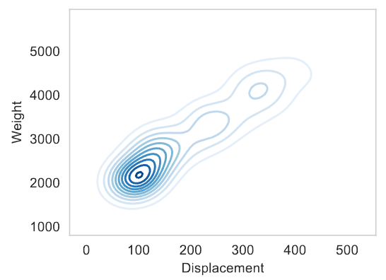


### R

GGPlot

```
library(ggplot2)
```

```R
ggplot(earthquake.df, aes(x=mag))+
geom_histogram(aes(y=..density..))+
geom_density()+ xlab("Magnitude")
```


#### KDE

```r
pplot(auto.data, aes(x=Displacement, y=Weight)) + geom_density_2d()
```

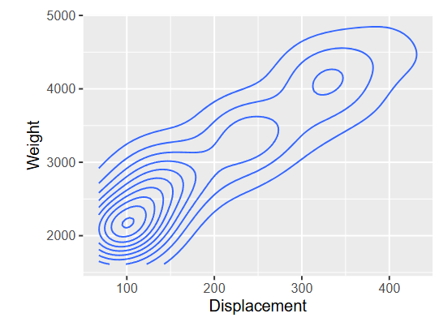


## EDA

### Density estimates

Here we use `kdeplot` and `histplot` to draw a histogram and a KDE (based on a Gaussian kernel) on the same axes.

```python
# Set the figure's size
plt.figure(figsize=(10,4))

# Draw a histogram and a KDE with Seaborn 
ax = sns.kdeplot( x, color="red", label="Kernel Density")
sns.histplot( x, stat="density", color = "darksalmon", label="Histogram"  )

# Finally, add a rug plot
sns.rugplot( np.array([1]), label="Rug Plot" )

# Add axis labels 
plt.xlabel('Grade of Spondylolisthesis')
plt.ylabel('Estimated Density')

# Set the limits on the axes
plt.xlim([-50,450])
plt.tight_layout()

# Save to a file and display
plt.savefig('Figures/spine_distplot.pdf')
plt.show()
```


### Log-transformed data

Transforming the data by taking its log expands the scale for smaller values, which can sometmes be illuminating.

```python
# Set the figure's size
plt.figure(figsize=(10,4))

# Plot the histogram and KDE
y = np.log(x-np.min(x)+1.0) # Log-transform the data to expand the scale for lower values

# Draw a histogram and a KDE
ax = sns.kdeplot( y, color="darkgreen", label="Kernel Density")
sns.histplot( y, stat="density", color = "darkseagreen", label="Histogram"  )

# Add a rug plot
sns.rugplot( y, label="Rug Plot")

# Add axis labels 
plt.xlabel('Log-transformed Grade of Spondylolisthesis')
plt.ylabel('Estimated Density')

# Set the limits on the axes
plt.xlim([-1,7])
plt.tight_layout()

# Save to a file and display
plt.savefig('Figures/spine_log.pdf')
plt.show()
```


### Changing the kernel function

Here we compute density estimates using three standard kernels: the uniform, triangular and Gaussian kernels.

```python
# The uniform kernel
mykde = sm.nonparametric.KDEUnivariate(x)
mykde.fit(kernel="uni", fft=False)
xuni = mykde.support
yuni = mykde.density

# The triangular kernel
mykde2 = sm.nonparametric.KDEUnivariate(x)
mykde2.fit(kernel="tri", fft=False)
xtri = mykde2.support
ytri = mykde2.density

# The Gaussian kernel
mykde3 = sm.nonparametric.KDEUnivariate(x)
mykde3.fit(kernel="gau")
xgau = mykde3.support
ygau = mykde3.density
```

#### Comparing KDEs based on the Gaussian and uniform kernels

```python
# Set the figure's size
plt.figure(figsize=(10,4))

# Plot the two KDEs
plt.plot(xgau,ygau,label='Gaussian Kernel',color=[0.5,0.5,0.5],linestyle='--')
plt.plot(xuni,yuni,label='Uniform Kernel',color=[0,0,0.7],linestyle='-')

# Add labels and a legend
plt.xlabel('Grade of Spondylolisthesis')
plt.ylabel('Estimated Density')
plt.xlim([-50,450])
plt.legend()
plt.tight_layout()

# Save to a file and display
plt.savefig('Figures/spine_uni.pdf')
plt.show()
```

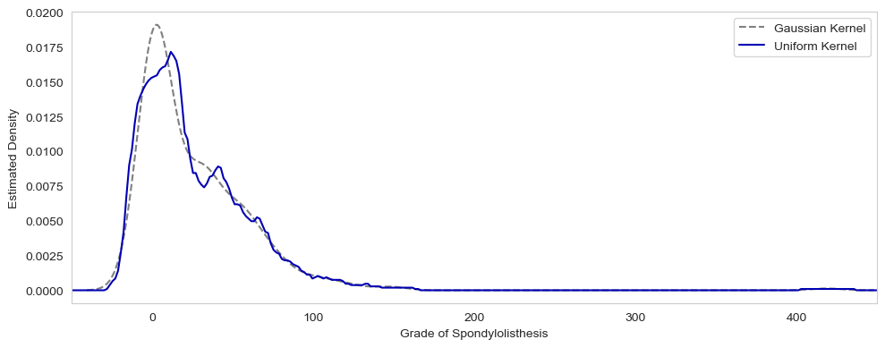

#### Comparing KDEs based on the Gaussian and triangular kernels

```python
# Set the figure's size
plt.figure(figsize=(10,4))

# Plot the two KDEs
plt.plot(xgau,ygau,label='Gaussian Kernel',color=[0.5,0.5,0.5],linestyle='--')
plt.plot(xtri,ytri,label='Triangular Kernel',color=[0.7, 0, 0],linestyle='-')

# Add labels and a legend
plt.xlabel('Earthquake Severity')
plt.ylabel('Estimated Density')
plt.xlabel('Grade of Spondylolisthesis')
plt.ylabel('Estimated Density')
plt.xlim([-50,450])
plt.legend()
plt.tight_layout()

# Save to a file and display
plt.savefig('Figures/spine_tri.pdf')
plt.show()
```


### Scatter Plots 

A scatter plot is a lossless visualisation that involves placing a marker at $(x_{ia}, x_{ib})$ for each $i$ and some $a, b$


```R
ggplot(auto.data, aes(x=Displacement,y=Weight)) + geom_point()
```

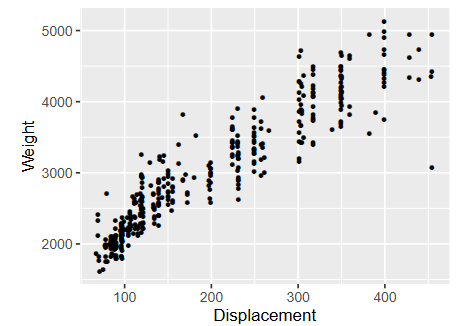

```python
plt.scatter(dis,wgt)
```

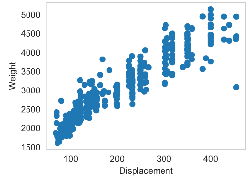


#### 2d Histograms

```r
ggplot(auto.data, aes(x=Displacement,y=Weight)) + geom_bin2d()
```

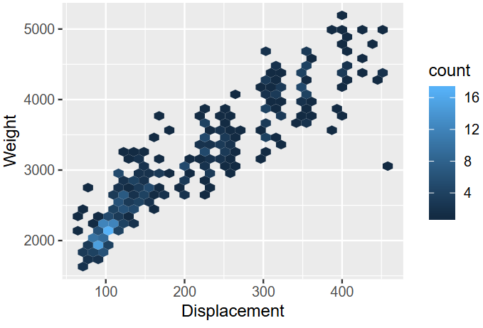

```python
plt.hist2d(dis,wgt, cmap='Blues')
```

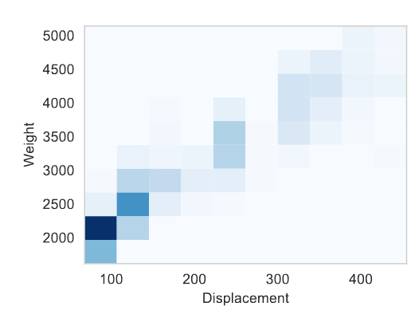
